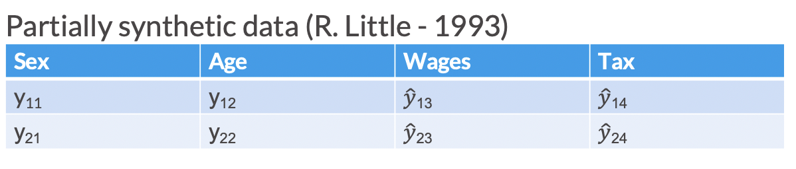
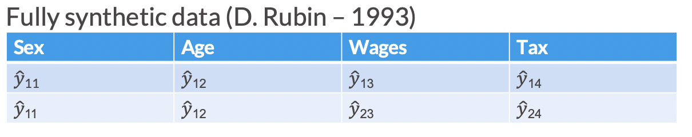

```{r rmarkdown-setup, echo = FALSE}
knitr::opts_chunk$set(warning = FALSE)
knitr::opts_chunk$set(message = FALSE)
```

```{=html}
<style>
@import url('https://fonts.googleapis.com/css?family=Lato&display=swap');
</style>
```
<link rel="stylesheet" href="//fonts.googleapis.com/css?family=Lato" />

```{r header-image, fig.width = 5.14, fig.height = 1.46, echo = FALSE}

# All defaults
knitr::include_graphics(here::here('www', 'images', 'urban-institute-logo.png'))

```


# Logistics and Reminders


- Access a recording of Lesson 1 [here](https://urbanorg.box.com/s/ug9ud42jt8xipdy5ys49npefim07lq9o).

- Email Maddie Pickens (mpickens@urban.org) for lesson HTML files.

- To follow along with optional code exercises, see "Exercise 3 (Optional)" for instructions on setting up an RStudio Cloud account and accessing the coding exercises (available in R and Python). This week's lesson contains dropdowns with R code for reference (click boxes labeled "Code" to view). We will not discuss these exercises or the R code in class.

<br> <br>

# Review of Synthetic Data


**Synthetic data** consists of pseudo or “fake” records that are statistically representative of the confidential data. Records are considered **synthesized** when they are replaced with draws from a model fitted to the confidential data. 

- The goal of most synthesis is to closely mimic the underlying distribution and statistical properties of the real data to preserve data utility while minimizing disclosure risks.
- Synthesized values also limit an intruder's confidence, because they cannot confirm a synthetic value exists in the confidential dataset.
- Synthetic data may be used as a “training dataset” to develop programs to run on confidential data via a validation server.


**Partially synthetic** data only synthesizes some of the variables in the released data (generally those most sensitive to disclosure). In partially synthetic data, there remains a one-to-one mapping between confidential records and synthetic records. Below, we see an example of what a partially synthesized version of the above confidential data could look like.

{width="437"}

**Fully synthetic** data synthesizes all values in the dataset with imputed amounts. Fully synthetic data no longer directly map onto the confidential records, but remain statistically representative. Since fully synthetic data does not contain any actual observations, it protects against both attribute and identity disclosure. Below, we see an example of what a fully synthesized version of the confidential data shown above could look like.


{width="439"}

<br> <br>

# Synthetic Data <-> Imputation Connection

- Multiple imputation was originally developed to address non-response problems in surveys [@rubin1977formalizing].
- Statisticians created new observations or values to replace the missing data by developing a model based on other available respondent information.
- This process of replacing missing data with substituted values is called **imputation**.

## Imputation Example

```{r, echo = F, setup}
# load packages we need
library(tidyverse)
library(urbnthemes)
library(palmerpenguins)
library(kableExtra)
library(gt)


# Helper function to create nice gt tables
create_table <- function(data_df, 
                         rowname_col = NA,
                         fig_num = "",
                         title_text = ""){
  # random_id = random_id(n=10)
  random_id = "urban_table"
  
  basic_table = data_df %>% 
    gt(id = random_id, rowname_col = rowname_col) %>% 
    tab_options(#table.width = px(760),
                table.align = "left", 
                heading.align = "left",
                # TODO: Discuss with Comms whether border should extend across 
                # whole row at bottom or just across data cells
                table.border.top.style = "hidden",
                table.border.bottom.style = "transparent",
                heading.border.bottom.style = "hidden",
                # Need to set this to transparent so that cells_borders of the cells can display properly and 
                table_body.border.bottom.style = "transparent",
                table_body.border.top.style = "transparent",
                # column_labels.border.bottom.style = "transparent",
                column_labels.border.bottom.width = px(1),
                column_labels.border.bottom.color = "black",
                # row_group.border.top.style = "hidden",
                # Set font sizes
                heading.title.font.size = px(13),
                heading.subtitle.font.size = px(13),
                column_labels.font.size = px(13),
                table.font.size = px(13),
                source_notes.font.size = px(13),
                footnotes.font.size = px(13),
                # Set row group label and border options
                row_group.font.size = px(13),
                row_group.border.top.style = "transparent",
                row_group.border.bottom.style = "hidden",
                stub.border.style = "dashed",
                ) %>% 
    tab_header(
      title = fig_num,# "eyebrow",
      subtitle = title_text) %>%  #"Top 10 Banks (by Dollar Volume) for Community Development Lending") %>% 
    # Bold title, subtitle, and columns
    tab_style(
      style = cell_text(color = "black", weight = "bold", align = "left"),
      locations = cells_title("subtitle")
    ) %>% 
    tab_style(
      style = cell_text(color = "#696969", weight = "normal", align = "left", transform = "uppercase"),
      locations = cells_title("title")
    ) %>% 
    tab_style(
      style = cell_text(color = "black", weight = "bold", size = px(13)),
      locations = cells_column_labels(gt::everything())
    ) %>% 
    # Italicize row group and column spanner text
    tab_style(
      style = cell_text(color = "black", style = "italic", size  = px(13)),
      locations = gt::cells_row_groups()
    ) %>% 
    tab_style(
      style = cell_text(color = "black", style = "italic", size  = px(13)),
      locations = gt::cells_column_spanners()
    ) %>% 
    opt_table_font(
        font = list(
          google_font("Lato"),
          default_fonts()
        )
      ) %>% 
    # Adjust cell borders for all cells, small grey bottom border, no top border
    tab_style(
      style = list(
        cell_borders(
          sides = c("bottom"),
          color = "#d2d2d2",
          weight = px(1)
        )
      ),
      locations = list(
        cells_body(
          columns =  gt::everything()
          # rows = gt::everything()
        )
      )
    )  %>%
    tab_style(
      style = list(
        cell_borders(
          sides = c("top"),
          color = "#d2d2d2",
          weight = px(0)
        )
      ),
      locations = list(
        cells_body(
          columns =  gt::everything()
          # rows = gt::everything()
        )
      )
    )  %>%
    # Set missing value defaults
    fmt_missing(columns = gt::everything(), missing_text = "—") %>%
    # Set css for all the things we can't finetune exactly in gt, mostly t/r/b/l padding
    opt_css(
      css = str_glue("
      #{random_id} .gt_row {{
        padding: 5px 5px 5px 5px;
      }}
      #{random_id} .gt_sourcenote {{
        padding: 16px 0px 0px 0px;
      }}
      #{random_id} .gt_footnote {{
        padding: 16px 0px 0px 0px;
      }}
      #{random_id} .gt_subtitle {{
        padding: 0px 0px 2px 0px;
      }}
      #{random_id} .gt_col_heading {{
        padding: 10px 5px 10px 5px;
      }}
      #{random_id} .gt_col_headings {{
        padding: 0px 0px 0px 0px;
        border-top-width: 0px;
      }}
      #{random_id} .gt_group_heading {{
        padding: 15px 0px 0px 0px;
      }}
      #{random_id} .gt_stub {{
        border-bottom-width: 1px;
        border-bottom-style: solid;
        border-bottom-color: #d2d2d2;
        border-top-color: black;
        text-align: left;
      }}
      #{random_id} .gt_grand_summary_row {{
        border-bottom-width: 1px;
        border-top-width: 1px;
        border-bottom-style: solid;
        border-bottom-color: #d2d2d2;
        border-top-color: #d2d2d2;
      }}
      #{random_id} .gt_summary_row {{
        border-bottom-width: 1px;
        border-top-width: 1px;
        border-bottom-style: solid;
        border-bottom-color: #d2d2d2;
      }}
      #{random_id} .gt_column_spanner {{
        padding-top: 10px;
        padding-bottom: 10px;
      }}
      ") %>% as.character()
    )
  
  return(basic_table)
}
# set Urban Institute data visualization styles
set_urbn_defaults(base_size = 12)


# set a seed so pseudo-random processes are reproducible
set.seed(20220301)

# Create data of conference attendees, where half are missing age
sample_conf <- tibble(
  attendee_number = 1:80,
  age = c(round(rnorm(n = 40, mean = 46, sd = 13), 0), rep(NA, 40))
)
```

Imagine you are running a conference with 80 attendees. You are collecting names and ages of all your attendees. Unfortunately, when the conference is over, you realize that only about half of the attendees listed their ages. One common imputation technique is to just replace the missing values with the mean age of those in the data. 


Shown below is the distribution of the 40 age observations that are not missing.

```{r, echo = F, fig.height = 3.5, before_hist}
# plot attendee ages

ggplot(sample_conf, aes(x = age)) +
  geom_histogram(binwidth = 5, color = "white") + 
  labs(title = 'Histogram of attendee ages')

# replace NA values with mean age
sample_conf <- sample_conf %>%
  mutate(
    age = if_else(
      condition = is.na(age), 
      true = round(mean(age, na.rm = TRUE), 0), 
      false = age
    )
  )

```

And after imptuation, the histogram looks like this:

```{r, echo = F, fig.height = 3.5, after_hist}
# replot the histogram
ggplot(sample_conf, aes(x = age)) +
  geom_histogram(binwidth = 5, color = "white") + 
  labs(title = 'Histogram of attendee ages (with missing values imputed)')
```


-   Using the mean to impute the missing ages removes useful variation and conceals information from the "tails" of the distribution.
-   Another way to think about it was that we used a really straightforward model (just replace the data with the mean) and sampled from that model to fill in the missing values.
-   When creating synthetic data, this process is repeated for an entire variable, or set of variables
-   In a sense, the entire column is treated as missing!


<br> <br>

# Sequential Synthesis

A more advanced implementation of synthetic data generation estimates models for each predictor with previously synthesized variables used as predictors. This iterative process is called **sequential synthesis**. This allows us to easily model multivariate relationships (or joint distributions) without being computationally expensive


The process described above may be easier to understand with the following table:


```{r, echo = FALSE}

table = tribble(~Step, ~Outcome, ~`Modelled with`, ~`Predicted with`,
                "1", "Sex", NA, "Random sampling with replacement",
                "2", "Age", "Sex", "Sampled Sex",
                "3", "Social Security Benefits","Sex, Age" , "Sampled Sex, Sampled Age",
                NA, NA, NA, NA,
                )

table %>% 
  create_table() 
```

<br>
<br>


- We can select the synthesis order based on the priority of the variables or the relationships between them.
- The earlier in the order a variable is synthesized, the better the original information is preserved in the synthetic data **usually**.
- [@bowen2021differentially] proposed a method that ranks variable importance by either practical or statistical utility and sequentially synthesizes the data accordingly.

<br> <br>

# Parametric vs. Nonparametric Data Generation Process

**Parametric data synthesis** is the process of data generation based on a parametric distribution or generative model.

- Parametric models assume a finite number of parameters that capture the complexity of the data.

- They are generally less flexible, but more interpretable than nonparametric models.

- Examples: regression to assign an age variable, sampling from a probability distribution, Bayesian models, copula based models.

**Nonparametric data synthesis** is the process of data generation that is *not* based on assumptions about an underlying distribution or model.

- Often, nonparametric methods use frequency proportions or marginal probabilities as weights for some type of sampling scheme.

- They are generally more flexible, but less interpretable than parametric models.

- Examples: assigning gender based on underlying proportions, CART (Classification and Regression Trees) models, RNN models, etc.

**Important:** Synthetic data are only as good as the models used for imputation!

<br> <br>

# Implicates

-   Researchers can create any number of versions of a partially synthetic or fully synthetic dataset. Each version of the dataset is called an **implicate**. These can also be referred to as replicates or simply "synthetic datasets"

    -   For partially synthetic data, non-synthesized variables are the same across each version of the dataset

-   Multiple implicates are useful for understanding the uncertainty added by imputation and are required for calculating valid standard errors

-   More than one implicate can be released for public use; each new release, however, increases disclosure risk (but allows for more complete analysis and better inferences, provided users use the correct combining rules)

-   Implicates can also be analyzed internally to find which version(s) of the dataset provide the most utility in terms of data quality

<br> <br>

#  Exercise 1

### Sequential Synthesis {.tabset}

#### <font color="#55b748">**Question 3**</font>

You have a confidential dataset that contains information about dogs' `weight` and their `height`. You decide to sequentially synthesize these two variables and write up your method below. Can you spot the mistake in writing up your method?

> To create a synthetic record, first synthetic pet weight is assigned based on a random draw from a normal distribution with mean equal to the average of confidential weights, and standard deviation equal to the standard deviation of confidential weights. Then the confidential height is regressed on the synthetic weights. Using the resulting regression coefficients, a synthetic height variable is generated for each row in the data using just the synthetic `weight`s as an input.


<br> <br>

#### <font color="#55b748">**Question 3 Notes**</font>

You have a confidential dataset that contains information about dogs' `weight` and their `height`. You decide to sequentially synthesize these two variables and write up your method below. Can you spot the mistake in writing up your method?


> To create a synthetic record, first synthetic pet weight is assigned based on a random draw from a normal distribution with mean equal to the average of confidential weights, and standard deviation equal to the standard deviation of confidential weights. Then the confidential height is regressed on the synthetic weights. Using the resulting regression coefficients, a synthetic height variable is generated for each row in the data using just the synthetic `weight`s as an input.

<br> <br>

- **`Height` should be regressed on the confidential values for `weight`, rather than the synthetic values for `weight`**


<br> <br>

### (Bonus) Implicates {.tabset}

#### <font color="#55b748">**Question 1**</font>

What are the privacy implications for releasing multiple versions of a synthetic dataset (implicates)? Do these implications change for partially vs. fully synthetic data?

<br> <br>

#### <font color="#55b748">**Question 1 Notes**</font>

What are the privacy implications for releasing multiple versions of a synthetic dataset (implicates)? Do these implications change for partially vs. fully synthetic data?

-   Releasing multiple implicates improves transparency and analytical value, but increases disclosure risk (violates "security through obscurity")

-   It is more risky to release partially synthetic implicates, since non-synthesized records are the same across each dataset and there remains a 1-to-1 relationship between confidential and synthesized records


<br> <br>

### (Bonus) Partial vs. fully synthetic {.tabset}

#### <font color="#55b748">**Question 2**</font>

What are the trade-offs of a partially synthetic dataset compared to a fully synthetic dataset?

<br> <br>

#### <font color="#55b748">**Question 2 Notes**</font>

What are the trade-offs of a partially synthetic dataset compared to a fully synthetic dataset?


- **Changing only some variables (partial synthesis) in general leads to higher utility in analysis since the relationships between variables are by definition unchanged (Drechsler et al, 2008).**

- **Disclosure in fully synthetic data is nearly impossible because all values are imputed, while partial synthesis has higher disclosure risk since confidential values remain in the dataset (Drechsler et al, 2008).**
  
  - **Note that while the risk of disclosure for fully synthetic data is very low, it is not zero.**

- **Accurate and exhaustive specification of variable relationships and constraints in fully synthetic data is difficult and if done incorrectly can lead to bias [@dreschlerjorgcomparingsynthetic].**
  
  - **If a variable is synthesized incorrectly early in a sequential synthesis, all variables synthesized on the basis of that variable will be affected.**

- **Partially synthetic data may be publicly perceived as more reliable than fully synthetic data.**

<br> <br>


# Demo: Creating Fully Synthetic `palmerpenguins` Data

The `palmerpenguins` package contains data about three species of penguins collected from three islands in the Palmer Archipelago, Antarctica. We will use an adapted version of the dataset to demonstrate some of the concepts discussed above.

```{r}
# create dataset we will be using
penguins <- penguins %>% 
  filter(species == "Adelie") %>% 
  select(
    sex, 
    bill_length_mm, 
    flipper_length_mm
  ) %>%
  drop_na() 

penguins %>% 
  head() %>% 
  create_table()
```

<br>

The above code simplifies the dataset to only three variables and removes missing values in those variables. We will synthesize the `sex`, `bill_length_mm`, and `flipper_length_mm` variables in this dataset using some of the methods discussed above. Since we are synthesizing all three variables, our final version of the dataset is considered fully synthetic.


### Synthesize `sex` variable

Let's start by synthesizing `sex`, which is a binary variable that can take a value of either "male" or "female". To synthesize this variable, we will identify the underlying percentages of the data that fall into each category and use it to generate records that mimic the properties of the confidential data.

```{r}
# identify percentage of total that each category (sex) makes up
penguins %>%
  count(sex) %>%
  mutate(relative_frequency = n / sum(n)) %>% 
  create_table()
```

<br>

Using these proportions, we will now randomly sample with replacement to mimic the underlying distribution of gender.

```{r}
# set a seed so pseudo-random processes are reproducible
set.seed(20220301)

# vector of gender categories
sex_categories <- c('female', 'male')

# size of sample to generate
synthetic_data_size <- nrow(penguins)

# probability weights
sex_probs <- penguins %>%
  count(sex) %>%
  mutate(relative_frequency = n / sum(n)) %>%
  pull(relative_frequency)

# use sample function to generate synthetic vector of genders
sex_synthetic <- sample(
  x = sex_categories, 
  size = synthetic_data_size, 
  replace = TRUE, 
  prob = sex_probs
)
```

Our new `sex_synthetic` variable will form the foundation of our synthesized data.

```{r}
# use vector to generate synthetic gender column
penguins_synthetic <- tibble(
  sex = sex_synthetic
)

penguins_synthetic %>% 
  head() %>% 
  create_table()
```

<br>

### Synthesize `bill_length_mm` variable

Unlike `sex`, `bill_length_mm` is numeric.

```{r}
summary(penguins$bill_length_mm)
```

<br>

To synthesize this variable, we are going to predict the `bill_length_mm` for each penguin using a linear regression with `sex` as a predictor. 

Note that `sex` is a factor variable with possible values of "male" and "female" which can't directly be used in a regression. So under the hood, R converts that factor variable into a binary numeric variables (i.e. `0` or `1`), and then runs the regression.

```{r}
# linear regression
bill_length_lm <- lm(
  formula = bill_length_mm ~ sex, 
  data = penguins
)

summary(bill_length_lm)
```

<br> <br>

Now that we have coefficients for the linear regression, we can generate our synthetic values. First, we try a straightforward prediction of bill lengths using the synthetic `sex` variable.

```{r}
# predict bill length with model coefficients
bill_length_synthetic_method1 <- predict(
  object = bill_length_lm, 
  newdata = penguins_synthetic
)

# add predictions to synthetic data as bill_length
penguins_synthetic_method1 <- penguins_synthetic %>%
  mutate(bill_length_mm = round(bill_length_synthetic_method1, 2))

penguins_synthetic_method1 %>% 
  head() %>% 
  create_table()
```


And now we compare the univariate distributions of the confidential data to our newly synthesized variable with a graph.

```{r}
# create dataframe with both confidential and synthesized values
compare_penguins <- bind_rows(
  "confidential" = penguins,
  "synthetic" = penguins_synthetic_method1,
  .id = "data_source"
)

# plot comparison of bill_length_mm distributions
compare_penguins %>%
  select(data_source, bill_length_mm) %>%
  pivot_longer(-data_source, names_to = "variable") %>%
  ggplot(aes(x = value, fill = data_source)) +
  geom_density(alpha = 0.3) +
  labs(title = "Comparison of Univariate Distributions",
       subtitle = "Method 1") +
  scatter_grid()
```

### What is the problem here?

Simply using the predicted values from our linear regression does not give us enough variation in the synthetic variable.

To understand more about the predictions made from the linear regression model, let's dig into the predicted values for the first five rows of data and the corresponding synthetic `sex`.

```{r}
# Look at first few rows of synthetic data
penguins_synthetic_method1 %>% 
  head() %>% 
  create_table()
```

<br>


We know from our regression analysis output from above that the intercept ($\beta_0$) is 42.1 and the coefficient for a male penguin ($\beta_1$) is 3.8. Therefore, if the penguin is male, we have a predicted value ($\hat{y}$) of `(42.1 + 3.8 = )` 45.9. If the penguin is female, our predicted value ($\hat{y}$) is only the intercept, 42.1. 

Because `sex` will only take two values, our synthetic `bill_length_mm` also only takes two values. The model fit limits the variation that is possible, making our synthetic variable significantly less useful.

Instead, we can try a second method. We will create a version of the variable, where the synthetic value is a draw from a normal distribution with a mean of the regression line for the given predictions, and standard deviation equal to the residual standard error.

```{r}
# set a seed so pseudo-random processes are reproducible
set.seed(20220301)

# predict bill length with model coefficients
bill_length_predicted <- predict(
  object = bill_length_lm, 
  newdata = penguins_synthetic
)

# synthetic column using normal distribution centered on predictions with sd of residual standard error
bill_length_synthetic_method2 <- rnorm(
  n = nrow(penguins_synthetic), 
  mean = bill_length_predicted, 
  sd = sigma(bill_length_lm)
)

# add predictions to synthetic data as bill_length
penguins_synthetic_method2 <- penguins_synthetic %>%
  mutate(bill_length_mm = round(bill_length_synthetic_method2, 2))

penguins_synthetic_method2 %>% 
  head() %>% 
  create_table()
```

Now, we again compare the univariate distributions of the confidential data and the synthetic data we generated with this second method.

```{r}
# create dataframe with both confidential and synthesized values
compare_penguins <- bind_rows(
  "confidential" = penguins,
  "synthetic" = penguins_synthetic_method2,
  .id = "data_source"
)

# plot comparison of bill_length_mm distributions
compare_penguins %>%
  select(data_source, bill_length_mm) %>%
  pivot_longer(-data_source, names_to = "variable") %>%
  ggplot(aes(x = value, fill = data_source)) +
  geom_density(alpha = 0.3) +
  labs(title = "Comparison of Univariate Distributions",
       subtitle = "Method 2") +
  scatter_grid()
```

We have much more variation with this new method, though the distributions still do not match perfectly. We choose this method's output to add as the synthetic `bill_length_mm` in our final synthesized dataset. And now our synthesized dataset has two columns.

```{r}
# using method 2 as synthesized variable
penguins_synthetic <- penguins_synthetic %>%
  mutate(bill_length_mm = bill_length_synthetic_method2)


penguins_synthetic %>% 
  head() %>% 
  create_table()
```

<br> 

### Synthesize `flipper_length_mm`

The `flipper_length_mm` variable is also numeric, so we can follow the same steps we used to synthesize `bill_length_mm`.

```{r}
summary(penguins$flipper_length_mm)
```

<br>

This time, we regress `flipper_length_mm` on both `sex` and `bill_length_mm`.

```{r}
# linear regression
flipper_length_lm <- lm(
  formula = flipper_length_mm ~ sex + bill_length_mm, 
  data = penguins
)

summary(flipper_length_lm)
```

<br> <br>

Since we already know we prefer the method using draws from the normal distribution centered on the mean of the regression line, we will default to that.

```{r}
# set a seed so pseudo-random processes are reproducible
set.seed(20220301)

# predict flipper length with model coefficients
flipper_length_predicted <- predict(
  object = flipper_length_lm, 
  newdata = penguins_synthetic
)

# synthetic column using normal distribution centered on predictions with sd of residual standard error
flipper_length_synthetic <- rnorm(
  n = nrow(penguins_synthetic), 
  mean = flipper_length_predicted, 
  sd = sigma(flipper_length_lm)
)

# add predictions to synthetic data as flipper_length
penguins_synthetic <- penguins_synthetic %>%
  mutate(flipper_length_mm = flipper_length_synthetic)
```

### Final (fully synthesized) product and discussion

With all three synthesized variables, we can compare the the univariate distributions of the confidential data and the synthetic data (we have already done this for `bill_length_mm`).

```{r}
# create dataframe with both confidential and synthesized values
compare_penguins <- bind_rows(
  "confidential" = penguins,
  "synthetic" = penguins_synthetic,
  .id = "data_source"
)

# Write out final compare_penguins df for use in future exercises
dir.create(here::here("data/"), showWarnings = FALSE)
compare_penguins %>% 
	write_csv(here::here("data", "penguins_synthetic_and_confidential.csv"))
```

First, we can compare the distributions of the `sex` variable in the confidential and synthetic data.

```{r, fig.height = 3}
sex_comparison <- compare_penguins %>%
  select(data_source, sex) %>%
  count(data_source, sex) %>%
  group_by(data_source) %>%
  mutate(relative_frequency = n / sum(n))

sex_comparison %>% 
  ggplot(aes(x = n, y = sex, fill = data_source)) +
  geom_text(aes(label = n), 
            position = position_dodge(width = 0.5),
            hjust = -0.4) + 
  geom_col(position = "dodge", alpha = 0.7) +
  scale_x_continuous(expand = expansion(add = c(0, 15))) +
  labs(y = "", x = "N", title = "Comparison of sex distribution")

```

```{r}
# plot comparison of distributions
compare_penguins %>%
  select(
    data_source, 
    bill_length_mm, 
    flipper_length_mm
  ) %>%
  pivot_longer(-data_source, names_to = "variable") %>%
  ggplot(aes(x = value, fill = data_source)) +
  geom_density(alpha = 0.3) +
  facet_wrap(~variable, scales = "free") +
  labs(title = "Comparison of Univariate Distributions",
       subtitle = "Final synthetic product") +
  scatter_grid()
```

<br> <br>

# Exercise 2

### (Bonus) Discuss `sex` synthesis {.tabset}

#### <font color="#55b748">**Question 1**</font>

-   Was the method we used parametric or nonparametric? Why?
-   What do we notice about the synthetic variable compared to the original?
-   We generated a new `sex` variable that was the same length as the confidential data. Was this necessary for the method to be applied correctly?

#### <font color="#55b748">**Question 1 Notes**</font>


- Was the method we used parametric or nonparametric? Why?
  
  - **Nonparametric; the data generation process was based on underlying frequencies rather than a distribution or generative model.**

- What do we notice about the synthetic variable compared to the original?

- We generated a new `sex` variable that was the same length as the confidential data. Was this necessary for the method to be applied correctly?
  
  - **No; the number of rows in the dataset does not matter as long as the underlying frequencies are preserved**


### (Bonus) Discuss `bill_length_mm` synthesis {.tabset}

#### <font color="#55b748">**Question 2**</font>


- Was the method we just used parametric or nonparametric? Why?

- What do we notice about the synthetic variable compared to the original?

- Are we synthesizing these data sequentially? How do you know?

#### <font color="#55b748">**Question 2 Notes**</font>
- Was the method we just used parametric or nonparametric? Why?
  
  - **Parametric; the data generation process was based on a (linear) model.**

- What do we notice about the synthetic variable compared to the original?

- Are we synthesizing these data sequentially? How do you know?
  
  - **Yes; the previously synthesized `sex` variable was used as a predictor.**

### (Bonus) Discuss `flipper_length_mm` synthesis {.tabset}

#### <font color="#55b748">**Question 3**</font>

-   What do we notice about the synthetic variable compared to the original?
-   What are benefits and drawbacks to generating this variable sequentially?

#### <font color="#55b748">**Question 3 Notes**</font>

-   What do we notice about the synthetic variable compared to the original?

-   What are benefits and drawbacks to generating this variable sequentially?

    -   **Benefits: generating this variable sequentially allows us to preserve more of the multivariate relationships present in the data**
    -   **Drawbacks: if we synthesized previous variables poorly, our synthesis of this variable will also be affected**

### Overall Discussion

<font color="#55b748">**Question 4**</font>

-   Would you feel comfortable using this version of the dataset for analysis? Why or why not? What additional tests might you run to determine this?

<br> <br>

# Exercise 3 (Optional)

<font color="#55b748">**Setup**</font>

Because the following exercise involves coding, it is optional and to be done on your own time.

To follow along, if you have not already you should **sign up for an Rstudio Cloud account and join the `Allegheny-count-data-privacy-trainings` space** so that you can follow along with our code exercises. You can do that by using [this link](https://rstudio.cloud/spaces/261189/join?access_code=dYVkt3WqVcoLNsJVuDk_ycR1hJaXZEUafvygUuCU){.uri}. You will know you've successfully joined the class space when you see the following in the top left of your Rstudio Cloud account:

{width="209"}

You can find Intro to R and Rstudio resources [here](https://rstudio.cloud/learn/primers) if you're unfamiliar with R. There will also be support for Python if you wish to use that. But again, all the code examples are optional and to be done on your own time. We will not be going over them in these trainings!

<br>

For this exercise, we will use the `starwars` dataset from the `dplyr` package. We will practice sequentially synthesizing a binary variable (`gender`) and a numeric variable (`height`).

```{r}
# run this to get the dataset we will work with
starwars <- dplyr::starwars %>%
  select(gender, height) %>%
  drop_na()

starwars %>% 
  head() %>% 
  create_table()
```

<br> <br>

<font color="#55b748">**Question 1: Gender synthesis**</font>

Fill in the blanks in the following code to synthesize the `gender` variable using the underlying distribution present in the data.

```{r eval = FALSE}
# set a seed so pseudo-random processes are reproducible
set.seed(20220301)

# Fill in the blanks!

# vector of gender categories
gender_categories <- c('feminine', 'masculine')

# size of sample to generate
synthetic_data_size <- nrow(starwars)

# probability weights
gender_probs <- starwars %>%
  count(gender) %>%
  mutate(relative_frequency = ### ______) %>%
  pull(relative_frequency)

# use sample function to generate synthetic vector of genders
gender_synthetic <- sample(
    x = ###_____, 
    size = ###_____,
    replace = ###_____, 
    prob = ###_____
)
                          
# create starwars_synthetic dataset using generated variable
starwars_synthetic <- tibble(
  gender = gender_synthetic
)
```

<br> <br>

<font color="#55b748">**Question 2: Height synthesis**</font>

Similarly, fill in the blanks in the code to generate the `height` variable using a linear regression with `gender` as a predictor.

```{r eval = FALSE}
# set a seed so pseudo-random processes are reproducible
set.seed(20220301)

# Fill in the blanks!

# linear regression
height_lm <- lm(
  formula = ###_____,
  data = ###______
)

# predict flipper length with model coefficients
height_predicted <- predict(
  object = height_lm, 
  newdata = ###_____
)

# synthetic column using normal distribution centered on predictions with sd of residual standard error
height_synthetic <- rnorm(
  n = ###_______, 
  mean = ###______, 
  sd = ###______
)

# add new values to synthetic data as height
starwars_synthetic <- starwars_synthetic %>%
  mutate(height = height_synthetic)
```

<br> <br>

# Feedback and (Optional) Homework

You can access the feedback form, along with optional homework questions to test your understanding, [here](https://forms.office.com/r/nE5MgQ48cD). We appreciate your feedback!

<br> <br>

# Suggested Reading

Raghunathan, T. E. (2021). Synthetic data. Annual Review of Statistics and Its Application, 8, 129-140.

<br> <br>

# References

Little, R. J. (1993). Statistical analysis of masked data. Journal of Official Statistics - Stockholm (9), 407-407.

Rubin, D. B. (1993). Statistical disclosure limitation. Journal of official Statistics, 9(2), 461-468.
