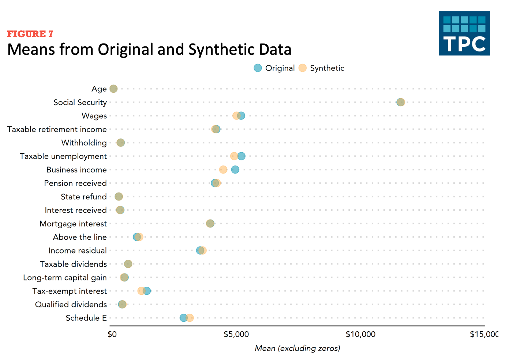
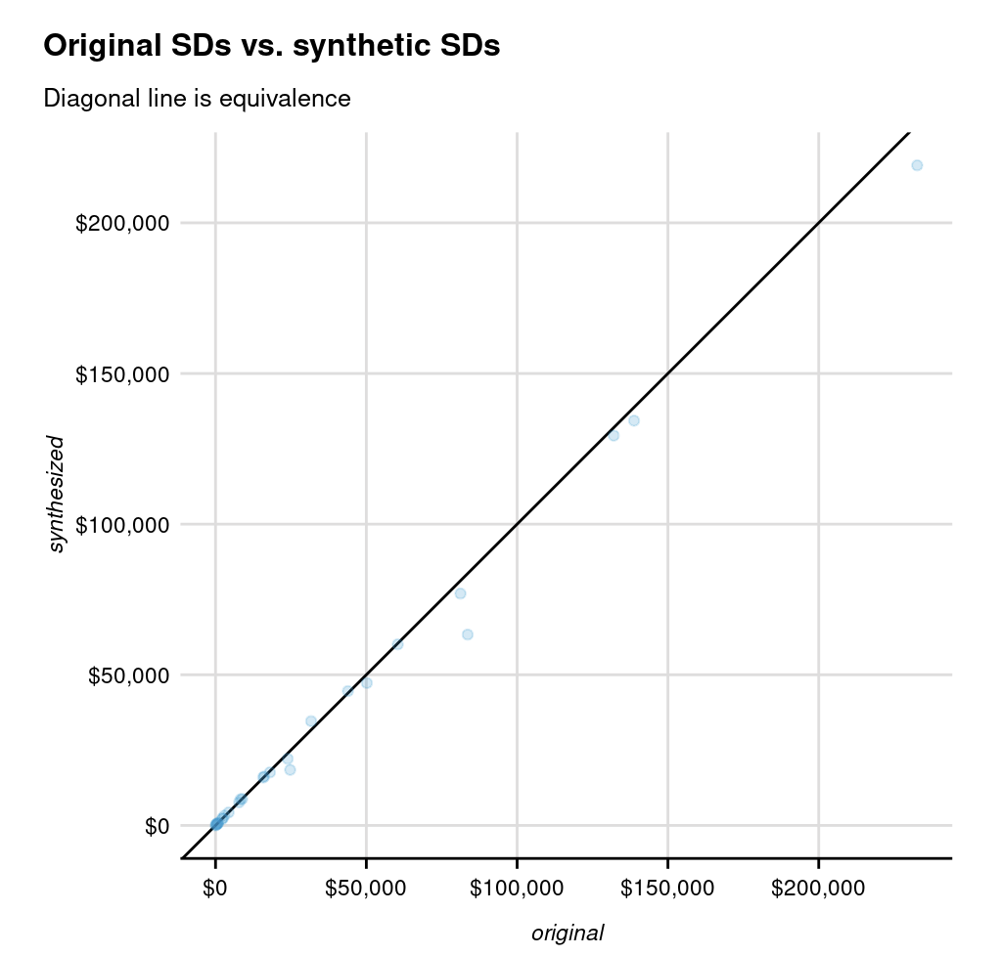
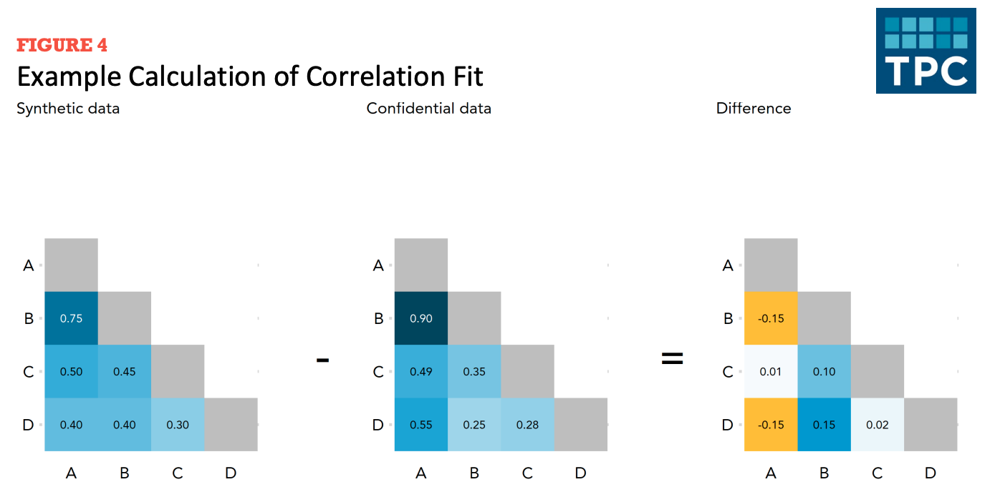
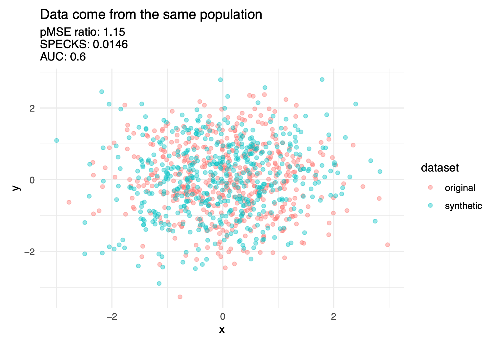
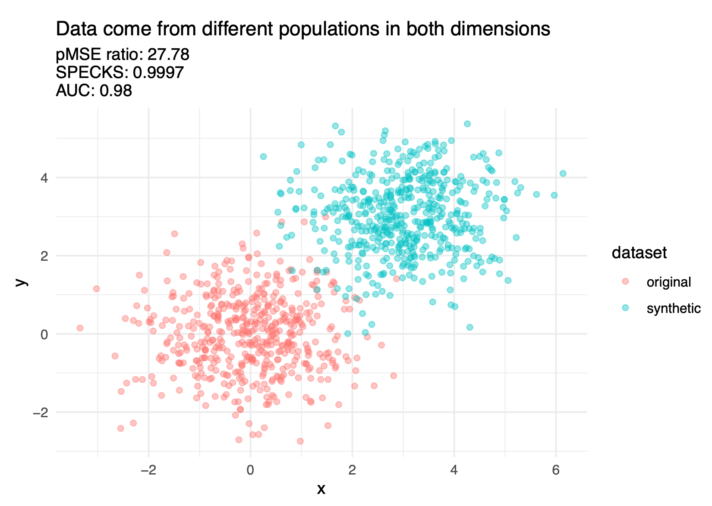
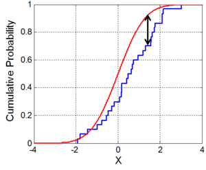
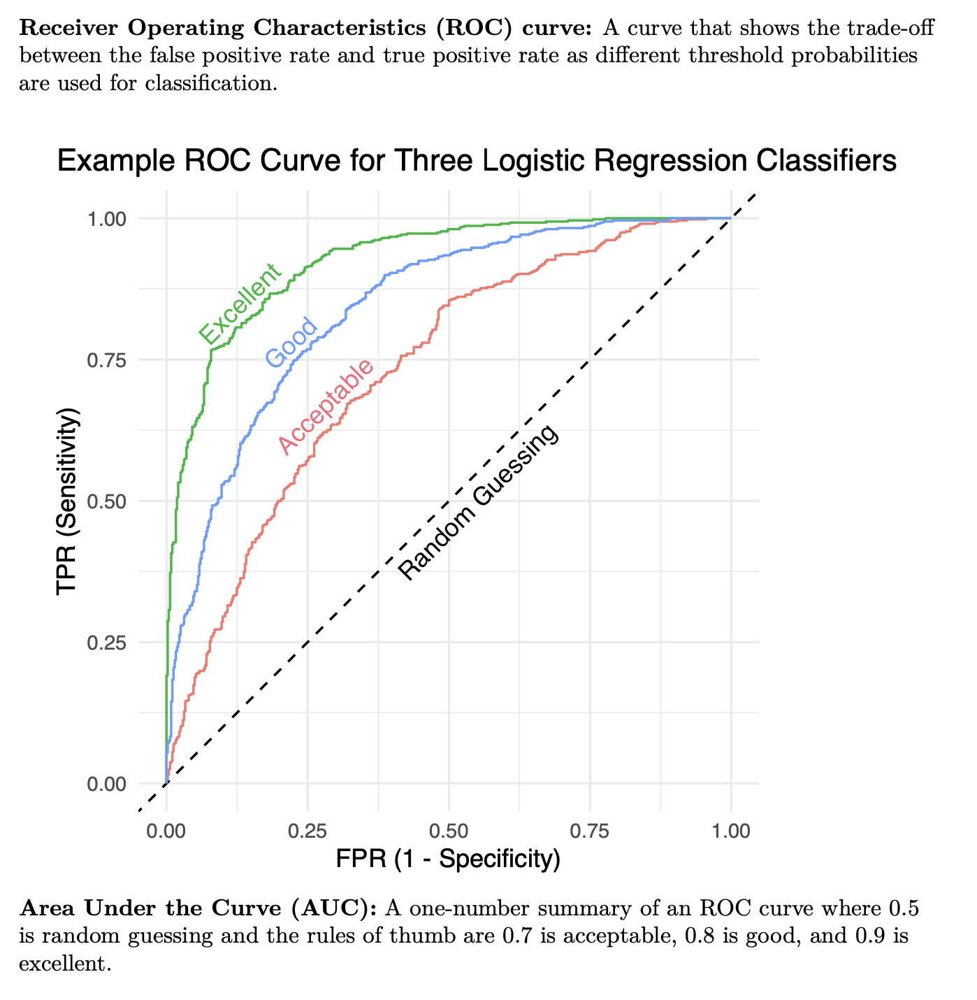
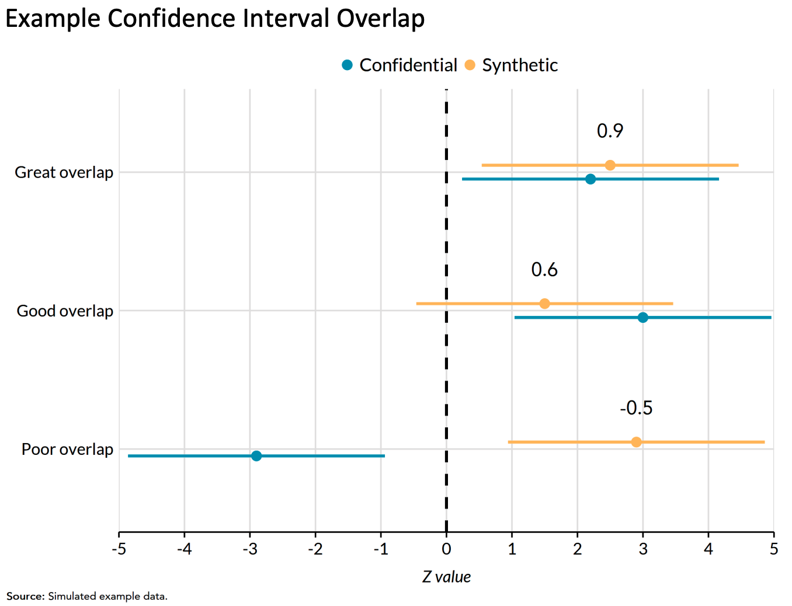
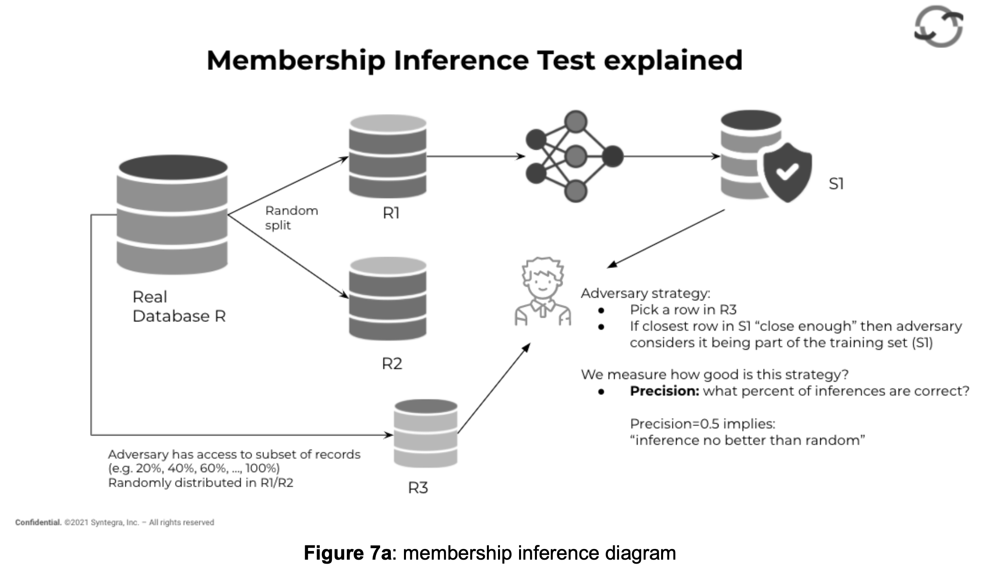

```{r rmarkdown-setup, echo = FALSE}
knitr::opts_chunk$set(warning = FALSE)
knitr::opts_chunk$set(message = FALSE)


```

```{=html}
<style>
@import url('https://fonts.googleapis.com/css?family=Lato&display=swap');
</style>
```
<link rel="stylesheet" href="//fonts.googleapis.com/css?family=Lato" />

```{r header-image, fig.width = 5.14, fig.height = 1.46, echo = FALSE}

# All defaults
knitr::include_graphics(here::here('www', 'images', 'urban-institute-logo.png'))

```

# Lesson 3: Utility and Disclosure Metrics + Case Studies

#### April 12, 2022


```{r setup}
options(scipen = 999)

library(tidyverse)
library(gt)
library(palmerpenguins)
library(urbnthemes)
library(here)

source(here("R", "create_table.R"))
```

<br>

# Recap

-   Last week we learned how to generate parametric and non-parametric synthetic data.

-   We generated synthetic data for the `palmerpenguins` data using sequential synthesis.

-   The models we used for synthesis were OLS regression, and simple random sampling with replacement.

-   Now that we've generated synthetic data, how do we evaluate the data, both in terms of usefulness and disclosure risks <br> <br>

# General Utility Metrics

-   As a refresher, general utility metrics measure the distributional similarity (i.e. all statistical properties) between the original and synthetic data.

-   Also known as "broad" or "global" utility because they compare wider aspects of the differences between synthetic and confidential data, often in the form of one summary metric.

-   General utility metrics are useful because they can provide a sense of how "fit for use" your synthetic data is for analysis, without having to make assumptions about the kinds of analysis people might use the synthetic data for.

-   Some common utility metrics are listed below:

## Summary statistics

-   For discrete variables, check if the counts or relative frequencies are similar. You can also make joint/relative frequency tables among pairs of variables.

-   For continuous variables: check mean, sd, skewness, kurtosis (i.e. first four moments) {width="469"}{width="436"}

-   Also useful to check medians, percentiles, and number of zero/non-zero values particularly with economic data

-   You should also visualize and compare univariate distributions using density plots. We already did this last week with our datasets, but this is very useful to do for each variable you synthesize.

```{r, echo = FALSE, fig.height = 3.5}
compare_penguins = read_csv(here::here("data", "penguins_synthetic_and_confidential.csv"))

# plot comparison of distributions
compare_penguins %>%
  select(
    data_source, 
    bill_length_mm, 
    flipper_length_mm
  ) %>%
  pivot_longer(-data_source, names_to = "variable") %>%
  ggplot(aes(x = value, fill = data_source)) +
  geom_density(alpha = 0.3) +
  facet_wrap(~variable, scales = "free") +
  labs(title = "Comparison of Univariate Distributions",
       subtitle = "Final synthetic product") +
  scatter_grid()
```

## Correlation Fit

**Correlation Fit**: Measures how well the synthesizer recreates the linear relationships between variables in the confidential dataset.

-   Create correlation matrices across columns in the data, and then measure differences across synthetic and actual data. Those differences are often summarized across all variables using [L1](https://en.wikipedia.org/wiki/Taxicab_geometry) or L2 distance. {width="574"}

## Discriminant Based Methods {.tabset}

**Discriminant based methods**: Can a model distinguish (i.e. discriminate) between records from the actual vs synthetic data?

-   Basic idea is to take the confidential data, smush it together with the synthetic data, and see if a model can distinguish (i.e. discriminate) between the two!

-   If the data synthesis process is good, then hopefully a model won't be able to distinguish between the two.

-   As a visual example of how these discriminant based methods work, imagine that we generated a really good synthetic dataset that closely aligned with the confidential data. These are what the general discriminant based utility metrics would look like.

{width="518"}

-   And if we generated a pretty poor synthetic dataset, these are what the general discriminant based utility metrics would look like:

{width="516"}

-   For all the below discriminant based methods, we generate propensity scores (i.e. the probability that a particular data point belongs to the confidential data) using a classifier model.

-   The first few steps for all the specific methods outlined below are the same:

    1)  *Combine the synthetic and confidential data. Add an indicator variable with 0 for the confidential data and 1 for the synthetic data*

        ```{r, echo = FALSE}
          
        set.seed(1297)
              
        x = penguins %>%
          select(species, bill_length_mm, sex) %>% 
          sample_n(2) %>% 
          add_row(.before = 2) %>% 
          mutate(ind = c(0, NA, 1))
              
        x %>% 
          create_table() %>% 
          fmt_missing(columns = everything(), 
                      missing_text = "...") %>% 
          tab_style(cell_fill(color = palette_urbn_main["cyan"], alpha = 0.3), 
                    locations = cells_body(columns = ind))
        ```

    <br>

    2)  *Calculate propensity scores (i.e. probabilities for group membership) for whether a given row belong to the synthetic dataset, typically with a classifier like logistic regression or CART.*

        ```{r, echo = FALSE}
        set.seed(1297)
            
            
                                x %>% 
          mutate(prop_score = c(0.32, NA, 0.64)) %>% 
          create_table() %>% 
          fmt_missing(columns = everything(), 
                      missing_text = "...") %>% 
          tab_style(cell_fill(color = palette_urbn_main["cyan"], alpha = 0.3), 
                    locations = cells_body(columns = prop_score))
        ```

    <br>

-   These propensity scores can be used to calculate various metrics for general utility, some of which are described below:

### pMSE

-   **pMSE**: Calculates the average Mean Squared Error (MSE) between the propensity scores and the expected probabilities:

-   Proposed by Woo et al. [@woo2009global] and enhanced by Snoke et al. [@snoke_raab_nowok_dibben_slavkovic_2018]

-   After doing steps 1) and 2) above:

    3)  *Calculate expected probability, i.e. the share of synthetic data in the combined data.* In the cases where the synthetic and confidential datasets are of equal size, this will always be 0.5.

        ```{r, echo = FALSE}
        set.seed(1297)
            
            
                                x %>% 
          mutate(prop_score = c(0.32, NA, 0.64),
                 exp_prob = c(0.5, NA, 0.5)) %>% 
          create_table() %>% 
          fmt_missing(columns = everything(), 
                      missing_text = "...") %>% 
          tab_style(cell_fill(color = palette_urbn_main["cyan"], alpha = 0.3), 
                    locations = cells_body(columns = exp_prob))
        ```

    <br>

    4)  *Calculate pMSE, which is mean squared difference between the propensity scores and expected probabilities.*

    $$pMSE = \frac{(0.32 - 0.5)^2 + ... + (0.64-0.5)^2}{N} $$

-   Often people use the pMSE ratio, which is the average pMSE score across all records, divided by the null model [@snoke2018general].

-   The null model is the the expected value of the pMSE score under the best case scenario when the model used to generate the data reflects the confidential data perfectly.

-   pMSE ratio = 1 means that your synthetic data and confidential data are indistinguishable. <br> <br> <br> <br> <br>

### SPECKS

-   **SPECKS**: **S**ynthetic data generation; **P**ropensity score matching; **E**mpirical **C**omparison via the **K**olmogorov-**S**mirnov distance. After generating propensity scores (i.e. steps 1 and 2 from above), you:

    3)  *Calculate the empirical CDF's of the propensity scores for the synthetic and confidential data, separately.*

    4)  *Calculate the Kolmogorov-Smirnov (KS) distance between the 2 empirical CDFs.* The KS distance is the maximum vertical distance between 2 empirical CDF distributions.

        {width="251"}

<br> <br> <br> <br> <br>

### ROC Curves/AUC

-   **ROC curves:** After generating propensity scores (i.e. steps 1 and 2 from above), you can create the ROC (Receiver Operating Characteristic curve) for the classifier and use that to evaluate how well your synthetic data mimics the confidential data.

{width="572"}

-   **AUC**: Area under the Receiver Operating Curve, a summary of how good your discriminator is.

-   In our context, ***High AUC*** = good at discriminating = ***poor synthesis***.

-   We want in the best case, AUC = 0.5 because that means the discriminator is no better than a random guess

<br> <br> <br> <br> <br> <br> <br> <br> <br> <br>


## Exercise 1: Calculating Utility Metrics

Assume that you have a confidential dataset of the starwars data, which is named `conf_data` below. You have already synthesized a fully synthetic dataset, named `synth_data` based on the confidential data. The `conf_data` looks like:

```{r, echo = FALSE}
set.seed(134)

conf_data = starwars %>% 
  select(gender, height, mass) %>% 
  tidylog::drop_na() %>%
  # Filter out one outlier mass value
  filter(mass != 1358)

conf_data %>% 
  head(2) %>% 
  add_row(gender = NA) %>% 
  create_table()
```

<br>

And `synth_data` looks like:

```{r, echo = FALSE}
nrow_conf_data = nrow(conf_data)

synth_data = tibble(
  gender = sample(conf_data$gender, size = nrow_conf_data, replace = F)
)

height_gender_model = lm(height ~ gender, data = conf_data)
height_gender_mass_model = lm(mass ~ height + gender, data = conf_data)


predicted_heights = predict(height_gender_model, data = synth_data)
predicted_masses = predict(height_gender_mass_model, data = synth_data)

synth_data = synth_data %>% 
  mutate(
    height = rnorm(n = nrow_conf_data,
                   mean = predicted_heights,
                   sd = sigma(height_gender_model)),
  )

synth_data = synth_data %>% 
  mutate(
    mass = rnorm(n = nrow_conf_data,
                 mean = predicted_masses,
                 sd = sigma(height_gender_mass_model)),
  )

synth_data %>% 
  head(2) %>% 
  add_row(gender = NA) %>% 
  create_table()

conf_data = conf_data %>% 
  mutate(
    gender = if_else(gender == "masculine", 0, 1)
  ) 

synth_data = synth_data %>% 
  mutate(
    gender = if_else(gender == "masculine", 0, 1)
  ) 

```

<br>
Question 1: Calculate the correlation fit between the synthetic and confidential data. Fill in the blanks and run the code below.

```{r, eval = FALSE}
# Fill in the blanks below:

# The cor() function can take in a dataframe and compute correlations 
# between all columns in the dataframe and spit out a correlation matrix
conf_data_correlations = cor(###)
synth_data_correlations = cor(###)

correlation_differences = conf_data_correlations - synth_data_correlations

# Correlation fit is the sum of the sqrt of the squared differences between each correlation in the difference matrix.
cor_fit = sum(sqrt( ### ^2))

cor_fit

```

Question 2: Compare the univariate distributions for `mass` and `height` in the confidential and synthetic data using density plots. Fill in the blanks and run the code below.

```{r,eval = FALSE}

combined_data = bind_rows("synthetic" = synth_data, 
                          "confidential" = conf_data,
                          .id = "type")

# Create a density plot of the mass distributions
combined_data %>% 
  ggplot(aes(x = ###,
             fill = type,),
         position = "dodge",
         color = "white") +
  geom_density(alpha = 0.4)

# Create a density plot of the height distributions
combined_data %>% 
  ggplot(aes(x = ###,
             fill = type,),
         position = "dodge",
         color = "white") +
  geom_density(alpha = 0.4)

```

<br>

# Specific Utility Metrics

-   Specific utility metrics measure how suitable a synthetic dataset is for specific analyses.

-   These specific utility metrics will change from dataset to dataset, depending on what you're using the data for.

-   A helpful rule of thumb: general utility metrics are useful for the data synthesizers to be convinced that they're doing a good job. Specific utility metrics are useful to convince downstream data users that the data synthesizers are doing a good job.

-   Some examples of specific utility metrics, though again these will vary dramatically, are below.

## Regression confidence interval overlap:

-   Measure of the overlap between confidence intervals for each coefficient in a linear regression model or logistic regression model estimated on the original data and a model estimated on the synthetic data.

{width="364"}

-   Note that this can be 0 or even negative when intervals don't overlap at all.

<br>

## Microsimulation results

-   Urban often uses microsimulation models, particularly with administrative tax data.

-   When we were synthesizing administrative tax data, one of the utility metrics were how close the microsimulation results ( e.g. projected income, capital gains, dividends, etc) were when using the confidential vs synthetic data as inputs to the tax calculator.

<br>

# Disclosure Risk Metrics

- How do we evaluate how well the synthetic data preserves privacy? That's where disclosure metrics come in.

## Identity Disclosure Metrics

-   Big picture: How often can we correctly re-identify confidential records from synthetic records for partially synthetic data?

-   For fully synthetic datasets, there is no one to one relationship between individuals and records so identity disclosure risk is a little ill-defined. Generally identity disclosure risk applies to partially synthetic datasets (or datasets protected with traditional SDC methods).

-   Most of these metrics rely on data maintainers essentially performing attacks against their synthetic data and seeing how successful they are at identifying individuals.

### Basic matching approaches {.tabset}

-   We start by making assumptions about the knowledge an attacker has (i.e. external publicly accessible data they have access to).

-   For each confidential record, the data attacker identifies a set of partially synthetic records which they believe contain the target record (i.e. potential matches) using the external variables as matching criteria.

-   There are distance-based and probability-based algorithms that can perform this matching. This matching process could be based on exact matches between variables or some relaxations (i.e. matching continuous variables within a certain radius of the target record, or matching adjacent categorical variables).

-   We then evaluate how accurate our re-identification process was using a variety of metrics.

As a simple example for the metrics we're about to cover, imagine a data attacker has access to the following external data:

```{r, echo = FALSE}
conf_data = starwars %>% 
  select(homeworld, species, name)


potential_matches_1 = conf_data %>% 
  filter(homeworld == "Naboo", species == "Gungan") 

potential_matches_2 = conf_data %>% 
  filter(homeworld == "Naboo", species == "Droid") 


external_data = potential_matches_1 %>% 
  slice(1) %>% 
  bind_rows(potential_matches_2)

external_data %>% 
  create_table() %>% 
  tab_style(
    style = list(
      cell_fill(color = palette_urbn_magenta[2])
      ),
    locations = cells_body(
      columns = "name"
  ))


```

<br> And imagine that the partially synthetic released data looks like this:

```{r echo = FALSE}
starwars %>% 
  select(homeworld, species, skin_color) %>% 
  head() %>% 
  create_table()
```

<br>

Note that the released partially synthetic data does not have names. But using some basic matching rules in combination with the external data, an attacker is able to identify the following potential matches for Jar Jar Binks and R2D2, two characters in the Starwars universe:

```{r , echo = FALSE}
potential_jar_jar_matches = starwars %>% 
  select(homeworld, species, skin_color) %>%
  filter(homeworld == "Naboo", species == "Gungan") %>% 
  mutate(title = "Potential Jar Jar matches")

potential_r2d2_matches = starwars %>% 
  select(homeworld, species, skin_color) %>%
  filter(homeworld == "Naboo", species == "Droid") %>% 
  mutate(title = "Potential R2-D2 Matches")

all_matches = potential_jar_jar_matches %>% 
  bind_rows(potential_r2d2_matches)

all_matches %>% 
  group_by(title) %>% 
  create_table() 

# todo color in cells by true matches
```

<br>

And since we are the data maintainers, we can take a look at the confidential data and know that the highlighted rows are "true" matches.

```{r, echo = FALSE}
all_matches %>% 
  group_by(title) %>% 
  create_table() %>% 
  tab_style(
    style = list(
      cell_fill(color = palette_urbn_magenta[2])
      ),
    locations = cells_body(
      rows = skin_color == "orange" | skin_color == "white, blue")
  )
```

<br>

These matches above are counted in various ways to evaluate identity disclosure risk. Below are some of those specific metrics. Generally for a good synthesis, we want a low expected match rate and true match rate, and a high false match rate.

<br>

#### Expected Match Rate

-   **Expected Match Rate**: On average, how likely is it to find a "correct" match among all potential matches? Essentially, the expected number of observations in the confidential data expected to be correctly matched by an intruder.

    -   Higher expected match rate = higher identification disclosure risk.

    -   The two other risk metrics below focus on the subset of confidential records for which the intruder identifies a single match.

    -   In our example, this is $\frac{1}{3} + 1 = 1.333$

<br> <br>

#### True Match Rate

-   **True Match Rate**: The proportion of true unique matches among all confidential records. Higher true match rate = higher identification disclosure risk.

-   Assuming there are 100 rows in the confidential data in our example, this is $\frac{1}{100} = 1\%$ <br> <br> <br> <br> <br> <br>

#### False Match Rate

-   **False Match Rate**: The proportion of false matches among the set of unique matches. Lower false match rate = higher identification disclosure risk.

-   In our example, this is $\frac{0}{1} = 0\%$ <br> <br> <br> <br> <br> <br>

## Attribute Disclosure risk metrics

-   Big picture: How well can we predict a sensitive attribute in a data set using the synthetic data (and external data)

-   Similar to above, you start by matching synthetic records to confidential records.

-   **key variables**: Variables that an attacker already knows about a record and can use to match.

-   **target variables**: Variables that an attacker wishes to know more or infer about using the synthetic data.

-   **Individual CAP (correct attribution probability) risk measure**: Probability that an intruder can correctly predict the value of the target variable for a record using the empirical distribution of this variable among synthetic observations with the same key variables.

-   **Average CAP risk measure**: Average of CAP measures across all records in the confidential data.

<br>
<br>

## Other Disclosure Risk Metrics

-   **Membership Inference Tests**: Can we perform a membership attack to determine if a particular record is in the confidential data?

    -   Why is this important? Sometimes membership in a synthetic dataset is also confidential (e.g. a dataset of HIV positive patients or people who have experienced homelessness).

    -   Also particularly useful for fully synthetic data where identity disclosure and attribute disclosure metrics don't really make a lot of sense.

    -   Assumes that attacker has access to a subset of the confidential data, and wants to tell if one or more records was used to generate the synthetic data.

    -   Since we as data maintainers know the true answers, we can evaluate whether the attackers guess is true and can break it down many ways (e.g. true positives, true negatives, false positives or false negatives).

        {width="688"}

        source for figure: @mendelevitch2021fidelity

    -   The "close enough" threshold is usually determined by a custom distance metric, like edit distance between text variables or numeric distance between continuous variables.

    -   Often you will want to choose different distance thresholds and evaluate how your results change.

-   **Copy Protection Metrics:** Is our synthesizer simply memorizing the confidential data? i.e. Are our models too good?

    -   ***Distance to Closest record***: Measures distance between each real record ($r$) and the closest synthetic record ($s_i$), as determined by a distance calculation.

        -   Many common distance metrics used in the literature including Euclidean distance, cosine distance, Gower distance, or Hamming distance [@mendelevitch2021fidelity].

        -   Goal of this metric is to easily expose exact copies or simple perturbations of the real records that exist in the synthetic dataset.

        ```{r, echo = FALSE, fig.height = 3}
        set.seed(123)
        df = tibble(
          dist = rnorm(n = 100, mean = 3, sd = 1)
        )

        df = df %>% 
          mutate(dist2 = c(rnorm(n = 75, mean = 3, sd = 1), rep(0, 25)))

        good_synth = df %>% 
          ggplot() + 
          geom_histogram(aes(x = dist), binwidth = 0.4, color = "white", fill = "steelblue") +
          labs(x = "DCR", y = "Count", title = "Mostly large DCR scores")

        bad_synth = df %>% 
          ggplot() + 
          geom_histogram(aes(x = dist2), binwidth = 0.4, color = "white", fill = "steelblue") +
          labs(x = "DCR", y = "Count", title = "Lots of 0 DCR scores")

        good_synth
        ```


        ```{r,echo = FALSE, fig.height = 3}
        bad_synth
        ```

        -   Note that having DCR = 0, doesn't necessarily mean a high disclosure risk because in some datasets the "space" spanned by the variables in scope is relatively small.

<br>
<br>

## Exercise 2: Disclosure Metrics

Following the same example with Jar Jar Binks above, let's assume that using external data an attacker was able to identify these 3 potential matches for Jar Jar Binks in the data. And because we have access to the confidential data, we know that the row in pink is a "correct" match. 

```{r, echo = FALSE}
potential_matches = tribble(~homeworld, ~species, ~skin_color,
                              "Naboo",	"Gungan",	"green",
                              "Naboo",	"Gungan",	"green",
                              "Naboo",	"Gungan",	"grey")

potential_matches %>% 
  create_table() %>% 
  tab_style(cell_fill(color = palette_urbn_main["magenta"], alpha = 0.3), 
                    locations = cells_body(rows = 3))
```

<br> 

Question 1: If an attacker randomly chooses one of these matches  to be Jar Jar Binks, what is the probability they will be right?

Question 2: Assume that previously an attacker did not know the `skin_color` of Jar Jar Binks. Using this list of matches, what approaches could an attacker take to guess the skin_color of Jar Jar Binks? What is the accuracy of each of those approaches?

<br>

# Case Studies

## Fully Synthetic PUF for IRS Non-Filers [@bowen2020synthetic]

* **Data:** A 2012 file of "non-filers" created by the IRS Statistics of Income Division.
* **Motivation:** Non-filer information is important for modeling certain tax reforms and this was a proof-of-concept for a more complex file.
* **Methods:** Sequential CART models with additional noise added based on the sparsity of nearby observations in the confidential distribution. 
* **Important metrics:**
    * General utility: Proportions of non-zero values, first four moments, correlation fit
    * Specific utility: Tax microsimulation, regression confidence interval overlap
    * Disclosure: Node heterogeneity in the CART model, rates of recreating observations
* **Lessons learned:**
    * Synthetic data can work well for tax microsimulation. 
    * It is difficult to match certain utility metrics for sparse variables.

## Fully Synthetic SIPP data [@benedetto2018creation]

* **Data:** Survey of Income and Program Participation linked to administrative longitudinal earnings and benefits data from IRS and SSA.
* **Motivation:** To expand access to detailed economic data that is highly restricted without heavy disclosure control. 
* **Methods:** Sequential regression multiple imputation (SRMI) with OLS regression, logistic regression, and Bayesian bootstrap. They released four implicates of the synthetic data.
* **Important metrics:**
    * General utility: pMSE
    * Specific utility: None
    * Disclosure: Distance based re-identification, RMSE of the closest record to measure attribute disclosure
* **Lessons learned:**
    * One of the first major synthetic files in the US.
    * The file includes complex relationships between family members that are synthesized. 
    
## Partially Synthetic Geocodes [@drechsler2021synthesizing]

* **Data:** Integrated Employment Biographies (German administrative data) with linked geocodes (latitude and longitude) 
* **Motivation:** Rich geographic information can be used to answer many important labor market research questions. This data would otherwise would be too sensitive to release, due to the possibility of identifying an individual based on the combination of their location and other attributes.
* **Methods:** CART with categorical geocodes. Also evaluated CART with continuous geocodes and a Bayesian latent class model.
* **Important metrics:**
    * General utility: Relative frequencies of cross tabulations
    * Specific utility: Zip Code comparisons of tabulated variables, Ripley's K- and L-functions
    * Disclosure: Probabilities of re-identification (Reiter and Mitra, 2009) -> comparison of expected match risk and the true match rate
* **Lessons learned:**
    * The synthetic data with geocodes had more measured disclosure risk than the original data. 
    * Synthesizing more variables made a huge difference in the measured disclosure risks.
    * Adjusting CART hyperparameters was not an effective way to manage the risk-utility tradeoff. 
    * They stratified the data before synthesis for computational reasons. 


# Optional HW

You can access the optional HW [here](https://forms.office.com/r/CMX74eVWkr). We promise it will only take a few minutes!

# Suggested Reading

Snoke, Joshua, Gillian M Raab, Beata Nowok, Chris Dibben, and Aleksandra Slavkovic. 2018b. “General and Specific Utility Measures for Synthetic Data.” Journal of the Royal Statistical Society: Series A (Statistics in Society) 181 (3): 663–88.

Bowen, Claire McKay, Victoria Bryant, Leonard Burman, Surachai Khitatrakun, Robert McClelland, Philip Stallworth, Kyle Ueyama, and Aaron R Williams. 2020. “A Synthetic Supplemental Public Use File of Low-Income Information Return Data: Methodology, Utility, and Privacy Implications.” In International Conference on Privacy in Statistical Databases, 257–70. Springer.


# References
